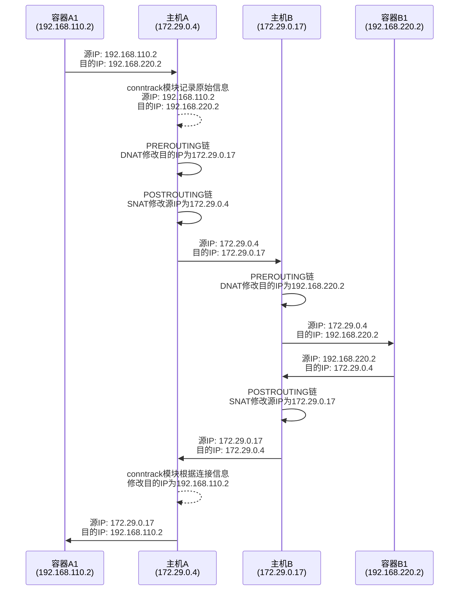

## 设备信息
- node1: node1-172-29-0-4
- node2: node2-172-29-0-17
- 容器内需要安装ip,ping等命令 `apt update && apt install iproute2 iputils-ping -y`

## 安装Docker
### 安装前清理一下老的安装包，
- 这里为可选操作，系统第一次安装的时候一般不会有docker的安装包信息；
- 如果是使用一台原来有部署过Docker服务的设备，这就需要清理；
```bash
for pkg in docker.io docker-doc docker-compose docker-compose-v2 podman-docker containerd runc; do sudo apt-get remove $pkg; done
```

### 通过apt安装
- 配置apt源
```bash
# Add Docker's official GPG key:
sudo apt-get update
sudo apt-get install ca-certificates curl
sudo install -m 0755 -d /etc/apt/keyrings
sudo curl -fsSL https://download.docker.com/linux/ubuntu/gpg -o /etc/apt/keyrings/docker.asc
sudo chmod a+r /etc/apt/keyrings/docker.asc

# Add the repository to Apt sources:
echo \
  "deb [arch=$(dpkg --print-architecture) signed-by=/etc/apt/keyrings/docker.asc] https://download.docker.com/linux/ubuntu \
  $(. /etc/os-release && echo "$VERSION_CODENAME") stable" | \
  sudo tee /etc/apt/sources.list.d/docker.list > /dev/null
sudo apt-get update
```
- 安装Docker组件
```bash
sudo apt-get install docker-ce docker-ce-cli containerd.io docker-buildx-plugin docker-compose-plugin
```

### 系统配置
本次实验涉及数据转发，所以需要开启`net.ipv4.ip_forward `参数
```
vim /etc/sysctl.conf

net.ipv4.ip_forward = 1

sysctl -p
```
## Docker配置
### node1 配置
```bash
# 创建一个网络，并且指定网关
docker network create --subnet 192.168.110.0/24 --gateway 192.168.110.1 bridge_a

# 启动一个容器，需要给容器指定网络，这里只用上面创建的bridge_a网络，并且将容器的IP设置为192.168.110.11 
docker run -it --net bridge_a --ip 192.168.110.11 -d --name n1  ubuntu

# 查看容器IP 
docker inspect -f '{{range .NetworkSettings.Networks}}{{.IPAddress}}{{end}}' n1

# 设置SNAT、DNAT规则,将容器的数据发出主机，以及将收到的数据包转发给容器
iptables -t nat -A POSTROUTING -s 192.168.110.0/24 ! -o docker0 -j MASQUERADE
iptables -t nat -A PREROUTING -d 192.168.220.0/24 -j DNAT --to-destination 172.29.0.17
```

### node2 配置
```bash
# 创建一个网络，并且指定网关
docker network create --subnet 192.168.220.0/24 --gateway 192.168.220.1 bridge_b

# 启动一个容器，需要给容器指定网络，这里只用上面创建的bridge_a网络，并且将容器的IP设置为192.168.110.11 
docker run -it --net bridge_b --ip 192.168.220.11 -d --name n2  ubuntu

# 查看容器IP 
docker inspect -f '{{range .NetworkSettings.Networks}}{{.IPAddress}}{{end}}' n2

# 设置SNAT、DNAT规则,将容器的数据发出主机，以及将收到的数据包转发给容器
iptables -t nat -A POSTROUTING -s 192.168.220.0/24 ! -o docker0 -j MASQUERADE
iptables -t nat -A PREROUTING -d 192.168.110.0/24 -j DNAT --to-destination 172.29.0.4
```
完成以上步骤后，node1主机的容器就可以跟node2主机的容器互通


## Iptables 规则解析
以在node1上的配置规则为例
- SNAT(Source NAT):
```bash
iptables -t nat -A POSTROUTING -s 192.168.110.0/24 ! -o docker0 -j MASQUERADE
```
这条规则的作用是,当源IP地址为192.168.110.0/24网段,且数据包不是从docker0网卡发出时,将数据包的源IP地址修改为主机的IP地址。这样,当容器访问外部网络时,外部网络看到的源IP地址就是主机的IP,而不是容器的私有IP。当外部网络返回数据包时,数据包可以正确地到达主机,然后主机再将数据包转发给相应的容器。
- DNAT(Destination NAT):
```bash
iptables -t nat -A PREROUTING -d 192.168.220.0/24 -j DNAT --to-destination 172.29.0.17
```
这条规则的作用是,当数据包的目的IP地址为192.168.220.0/24网段时,将目的IP地址修改为172.29.0.17(主机B的IP地址)。这个规则解决了跨主机容器通信的问题。当主机A的容器(192.168.110.0/24)要访问主机B的容器(192.168.220.0/24)时,数据包的目的IP是192.168.220.0/24网段的IP,主机A收到数据包后,通过DNAT规则将目的IP改写为主机B的IP(172.29.0.17),然后根据路由规则将数据包发送给主机B。主机B收到数据包后,再根据自己的DNAT规则,将目的IP修改为实际的容器IP,最终将数据包转发给目标容器。

### 完整的逻辑如下

在数据包流传过程中,除了NAT规则外,还有一个重要的角色是conntrack(连接跟踪)模块。
- 当容器A1(192.168.110.2)向容器B1(192.168.220.2)发送数据包时:
1. 数据包离开容器A1,源IP为192.168.110.2,目的IP为192.168.220.2。
2. 数据包到达主机A的PREROUTING链,匹配到DNAT规则,目的IP被修改为主机B的IP 172.29.0.17。
3. 数据包经过路由决策,被发送到主机B。在离开主机A时,数据包经过POSTROUTING链,匹配到SNAT规则,源IP被修改为主机A的IP 172.29.0.4。
4. 主机B收到数据包,原始的目的IP为192.168.220.2,此时conntrack模块记录下这个连接:源IP 172.29.0.4,目的IP 192.168.220.2。
5. 数据包到达主机B的PREROUTING链,匹配到DNAT规则,目的IP被修改为容器B1的实际IP 192.168.220.2。
6. 数据包被转发到容器B1。

- 当容器B1(192.168.220.2)向容器A1(192.168.110.2)返回数据包时:
1. 数据包离开容器B1,源IP为192.168.220.2,目的IP为192.168.110.2。
2. 数据包到达主机B的PREROUTING链,匹配到DNAT规则,目的IP被修改为主机A的IP 172.29.0.4。
3. 在离开主机B时,数据包经过POSTROUTING链,匹配到SNAT规则,源IP被修改为主机B的IP 172.29.0.17。同时,conntrack模块识别出这个数据包属于之前记录的连接,并自动将目的IP修改为原始的源IP 172.29.0.4。
4. 主机A收到数据包,原始的目的IP为172.29.0.4,conntrack模块识别出这个数据包属于之前的连接,并自动将目的IP修改为原始的目的IP 192.168.110.2。
5. 数据包被转发到容器A1。

关键点在于,conntrack模块在NAT过程中记录了原始的IP信息,当收到返回的数据包时,可以自动将NAT后的IP还原为原始IP,保证了数据包的正确流向。
所以,尽管在跨主机通信过程中,数据包的源IP和目的IP都被修改了,但是由于conntrack模块的存在,数据包最终还是能够正确地到达目标容器。这就是conntrack模块在Docker跨主机通信中的重要作用。

