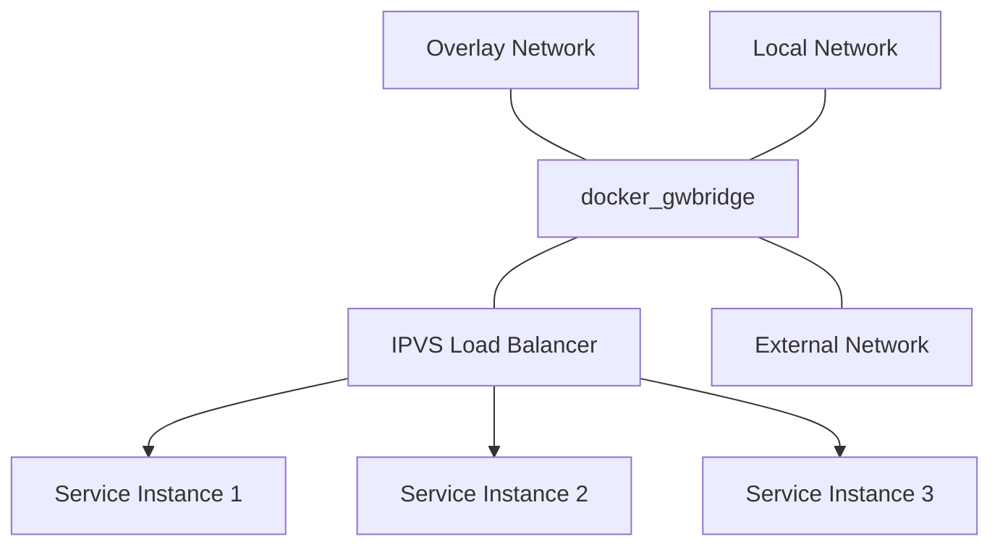
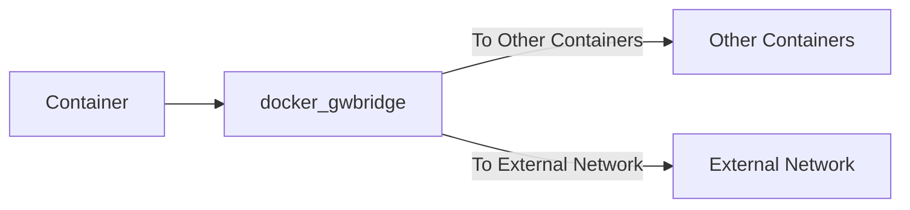
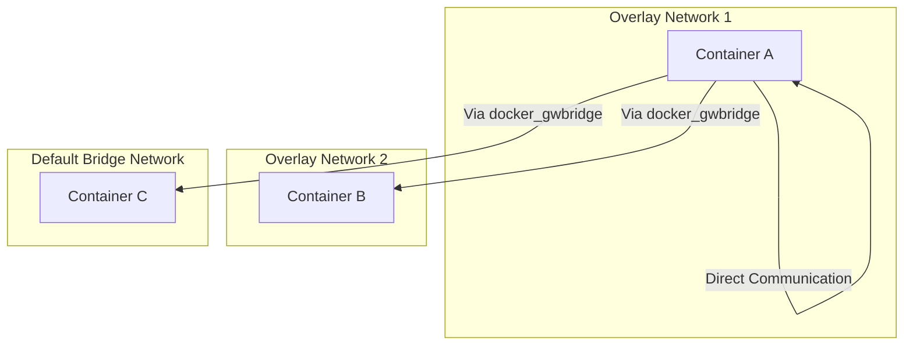

# Docker Swarm 网络模式
## 网络类型
### docker_gwbridge

1. `docker_gwbridge`的主要作用:
    - 连接overlay网络和local网络,充当它们之间的桥梁。
    - 为连接到overlay网络的容器提供默认网关。
    - 参与ingress流量的路由,将外部请求转发到正确的服务实例。
    - 为Swarm模式下的服务分配虚拟IP地址(VIP)。

2. 容器北向流量的流向:
    - 当容器需要访问外部网络或其他网络资源时,流量需要经过`docker_gwbridge`。
    - `docker_gwbridge`充当了容器的"北向网关",负责将流量路由到正确的目标。
    - 具体的流量路径取决于源容器和目标容器的网络配置:
        - 如果它们都连接到同一个overlay网络,流量可以直接在overlay网络内部进行路由。
        - 如果它们连接到不同的overlay网络,或者目标容器只连接到默认的bridge网络,那么流量需要先经过`docker_gwbridge`,然后再到达目标网络和容器。

除了这些关键点,还有一些额外的细节值得注意:

1. `docker_gwbridge`的创建时机:
    - 当你初始化一个新的Swarm集群或者将一个节点加入现有的Swarm集群时,Docker会自动在每个节点上创建`docker_gwbridge`网桥。
    - 这确保了所有的Swarm节点都有一个一致的网络配置,为容器的跨主机通信提供了基础。

2. `docker_gwbridge`的IP地址范围:
    - `docker_gwbridge`的IP地址范围是在创建Swarm集群时自动分配的。
    - 默认情况下,它使用`172.18.0.0/16`的子网。
    - 每个节点上的`docker_gwbridge`都有一个唯一的IP地址,通常是`172.18.0.1`。
    - 服务的虚拟IP地址(VIP)也是从这个子网中分配的。

3. `docker_gwbridge`与ingress网络:
    - 除了`docker_gwbridge`,Docker Swarm还有另一个特殊的overlay网络,称为"ingress"网络。
    - Ingress网络用于实现Swarm集群的负载均衡和服务发现。
    - 当你发布一个服务的端口时,Swarm会自动将服务附加到ingress网络。
    - 外部请求首先到达ingress网络,然后被路由到`docker_gwbridge`,最后到达服务实例。

总的来说,`docker_gwbridge`在Docker Swarm的网络架构中扮演着至关重要的角色。它连接了不同的网络,为容器提供了默认网关,并参与了ingress流量的路由。理解`docker_gwbridge`的作用和容器北向流量的流向,对于掌握Docker Swarm的网络模型和故障排除非常有帮助。

- `docker_gwbridge`流量走向图





## 验证环节
### 实验环境部署
- 创建一个overlay网络zf-net
    ```
  docker network create -d overlay zf-net
  ```
  
- 创建一个服务，并将服务加入到zf-net的网络中
    ```
   docker service create --network zf-net --publish 18888:80 --replicas 3  --name web nginx
  ```
  
1. 验证当容器需要访问外部网络或其他网络资源时,流量需要经过`docker_gwbridge`。

   在web容器中执行`ping 111.12.36.131 -c 1`，容器会访问公网的111.12.36.131的IP，网络包如下
   
   可以看到，容器内执行命令之后，网络包从`veth60c57b4`网卡发出，然后到`docker_gwbridge`,再到宿主机的`eth0`，远程主机回来的响应数据包与发出数据包的路径正好相反。
   
   数据流向如下
   ```mermaid
   sequenceDiagram
    participant Container as Container<br/>172.18.0.3
    participant veth60c57b4 as veth60c57b4<br/>veth-pair
    participant docker_gwbridge as docker_gwbridge
    participant eth0 as eth0<br/>VM-29-12-ubuntu
    participant RemoteHost as Remote Host<br/>111.12.36.131

    Container ->> veth60c57b4: ICMP Echo Req
    veth60c57b4 ->> docker_gwbridge: Fwd Echo Req
    docker_gwbridge ->> eth0: SNAT + Fwd
    eth0 ->> RemoteHost: ICMP Echo Req
    RemoteHost ->> eth0: ICMP Echo Reply
    eth0 ->> docker_gwbridge: Recv Reply
    docker_gwbridge ->> veth60c57b4: DNAT + Fwd
    veth60c57b4 ->> Container: Fwd Echo Reply
   ```
2. 如果它们都连接到同一个overlay网络,流量可以直接在overlay网络内部进行路由。
   
   从tcpdump的网络包上看到，运行在宿主机VM-29-12-ubuntu上的容器，与在zf-net网络内的容器通讯时，不经过宿主机的网络（eth0）,也不经过`docker_gwbridge`
   
   
3. 如果它们连接到不同的overlay网络,或者目标容器只连接到默认的bridge网络,那么流量需要先经过docker_gwbridge,然后再到达目标网络和容器。