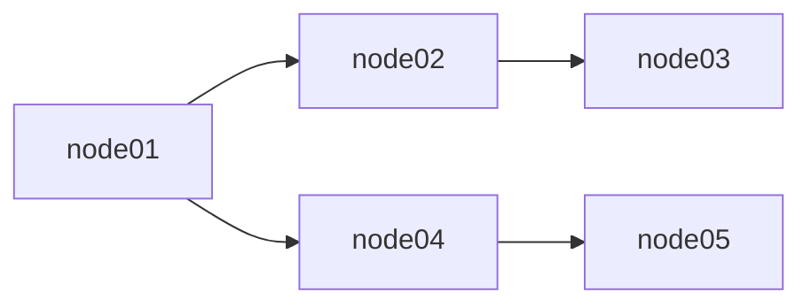
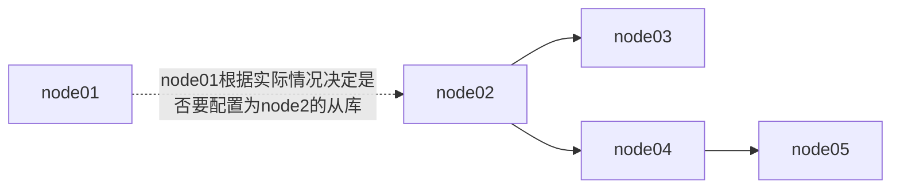

# MySQL安装
## 系统情况
- 服务器版本: CentOS Linux release 7.9.2009 (Core)
- 实例规格：腾讯云 2C/4G/50G
- 实例数量：
- MySQL 版本：MySQL 5.7.44
- 主机信息如下

  | 主机名    | IP           |
  |--------|--------------|
  | node01 | 172.16.16.2  |
  | node02 | 172.16.16.5  |
  | node03 | 172.16.16.13 |
  | node04 | 172.16.16.14 |
  | node05 | 172.16.16.15 |

## 实验设计
- 1、使用MySQL的GDIT复测策略
- 2、5个MySQL实例使用联级复制
- 3、故障切换演练

## MySQL联级复制架构

- node01作为Master，node02、node04为Matser的第一级复制
- node03、node05分别为node02、node04的下级复制节点

## 系统初始化
### host配置（ALL）

```bash
echo "
172.16.16.2 node1
172.16.16.5 node2
172.16.16.13 node3
172.16.16.14 node4
172.16.16.15 node5
" >> /etc/hosts
```
### ssh key配置（node01）
```bash
ssh-keygen -t rsa
ssh-copy-id root@node02
ssh-copy-id root@node03
ssh-copy-id root@node04
ssh-copy-id root@node05
```
### yum源配置(ALL)
```bash
#设置yum源
sudo rpm --import https://repo.mysql.com/RPM-GPG-KEY-mysql-2022
wget http://repo.mysql.com/mysql57-community-release-el7-10.noarch.rpm
rpm -Uvh mysql57-community-release-el7-10.noarch.rpm
#安装
yum install -y mysql-community-server
```

### MySQL 配置文件(ALL)
```ini
[mysql]
prompt=\\u@\\h (\\U) \\R:\\m:\\s>

[client]
socket=/data/mysql/mysql.sock

[mysqld]
# 通用配置
datadir=/data/mysql/data
socket=/data/mysql/mysql.sock
tmpdir=/data/mysql/tmp
log-error=/data/mysql/logs/error.log
pid-file=/data/mysql/mysql.pid
user=mysql
port=3306
character-set-server=utf8mb4
collation-server=utf8mb4_unicode_ci
lower_case_table_names=1
max_allowed_packet=128M
sql_mode='STRICT_TRANS_TABLES,NO_ZERO_IN_DATE,NO_ZERO_DATE,ERROR_FOR_DIVISION_BY_ZERO,NO_ENGINE_SUBSTITUTION'

# InnoDB 设置
default-storage-engine=InnoDB
innodb_buffer_pool_size=2G
innodb_log_file_size=512M
innodb_log_files_in_group=2
innodb_flush_log_at_trx_commit=1
innodb_file_per_table=1
innodb_flush_method=O_DIRECT
innodb_io_capacity=2000
innodb_io_capacity_max=4000

# 复制设置
server_id=1 # 每个节点的 server_id 需要唯一
log_bin=/data/mysql/logs/binlog
binlog_format=ROW
binlog_row_image=FULL
gtid_mode=ON
enforce_gtid_consistency=ON
log_slave_updates=ON
skip_slave_start=1
relay_log=/data/mysql/logs/relaylog
relay_log_recovery=1
read_only=0 # Master 节点设为0,其他节点设为1

# 半同步复制设置
plugin_load='rpl_semi_sync_master=semisync_master.so;rpl_semi_sync_slave=semisync_slave.so'
loose_rpl_semi_sync_master_enabled=1
loose_rpl_semi_sync_slave_enabled=1
loose_rpl_semi_sync_master_timeout=5000

# 其他优化设置
table_open_cache=4096
max_connections=1000
back_log=1000
thread_cache_size=128
key_buffer_size=64M
read_buffer_size=1M
read_rnd_buffer_size=4M
bulk_insert_buffer_size=64M
```
### MySQL 初始化
```bash
#创建服务目录，设置权限
mkdir -pv /data/mysql/{data,logs/tmp}
chown -R mysql:mysql /data/mysql/
```

### 服务管理(ALL)
```bash
#查看服务状态
systemctl status mysqld.service
#启动服务
systemctl start mysqld.service
#关闭服务
systemctl stop mysqld.service
#重启服务
systemctl restart mysqld.service
#加入自启动
systemctl enable mysqld.service
```

### 设置登录账号信息（ALL）
在MySQL启动之后，MySQL会自动生成一个初始化的密码，然后写入启动日志，使用初始化密码登录之后需要修改
```bash
# 查看初始化密码
grep 'temporary password' /var/log/mysqld.log

# 使用初始密码之后修改密码，由于MySQL对密码强度有要求，密码设置要有一定的复杂度，这里由于是实验环境，登录MySQL后关闭密码验证策略
set global validate_password_policy=0;
set global validate_password_length=1;

# 本地root账号登录
ALTER USER 'root'@'localhost' IDENTIFIED BY '123456';

# 远程root账号登录
GRANT ALL PRIVILEGES ON *.* TO 'root'@'%' IDENTIFIED BY '123456' WITH GRANT OPTION;

#刷新权限信息
FLUSH PRIVILEGES;
```
### Master设置复制账号（node01）
```bash
# 本次实验复制范围是整个Master库，所以在Master上创建的账号在完成主从复制配置之后，账号会同步给下游的从库，如果是仅复制特定的数据库，就需要在node02、node04上单独创建复制账号给下游从库使用
CREATE USER 'repl'@'%' IDENTIFIED BY '123456';
GRANT REPLICATION SLAVE ON *.* TO 'repl'@'%';
```
### 配置主从复制
- node01
```mysql
# 查看Master的log状态，由于是GDIT复制，Slave会自动找到待复制的位点。本次实验是新服务部署，从库没有数据库的导入的操作。
show master status ;
#查看有哪些从库
show slave hosts 
```
### 一级从库
- node02 node04
```mysql
# 设置主库
CHANGE MASTER TO
    MASTER_HOST='172.16.16.2',
    MASTER_PORT=3306,
    MASTER_USER='repl',
    MASTER_PASSWORD='123456',
    MASTER_AUTO_POSITION=1;

# 启动复制
START SLAVE;

# 观察主从复制状态
SHOW SLAVE STATUS ;

#查看有哪些从库
show slave hosts 
```
### 二级从库
- node3
```mysql
CHANGE MASTER TO
MASTER_HOST='172.16.16.5',
MASTER_PORT=3306,
MASTER_USER='repl',
MASTER_PASSWORD='123456',
MASTER_AUTO_POSITION=1;
```
- node5
```mysql
CHANGE MASTER TO
MASTER_HOST='172.16.16.14',
MASTER_PORT=3306,
MASTER_USER='repl',
MASTER_PASSWORD='123456',
MASTER_AUTO_POSITION=1;
```

## 故障切换演练
### Master（node01）故障
Master故障的情况下，可以将node02或node04提升为Master，本次使用node02作为主库演示，完成后的架构如下

## 操作步骤
由于操作存在风险，如操作不规范，Master上的数据可能未完全同步给下游节点，导致下游节点提升为主库时数据丢失。
### 操作前准备（Node01）
- 1、操作前将业务暂停，禁止业务写数据到主库；
- 2、确认主库当前没有未完成的事务；`SHOW PROCESSLISTS;` 或者 `SHOW ENGINE INNODB STATUS;` 查看
- 3、给主库添加全局写锁`FLUSH TABLES WITH READ LOCK;`,使整个MySQL实例将处于只读状态

### 从库node02提升为主库
```mysql
# 确保复制已经完全同步，Seconds_Behind_Master: 为0
SHOW SLAVE STATUS\G

# 停止复制线程
STOP SLAVE;

#重置从库
RESET SLAVE ALL;

# 清空 gtid_executed 集合并重置二进制日志
RESET MASTER;
```

### Node3,Node4操作
```mysql
STOP SLAVE;
CHANGE MASTER TO MASTER_HOST='slave1的IP地址', MASTER_USER='复制用户', MASTER_PASSWORD='复制用户密码', MASTER_AUTO_POSITION = 1;
START SLAVE;
```

### Node5
Node5 继续从Node4上复制数据，无需变更配置